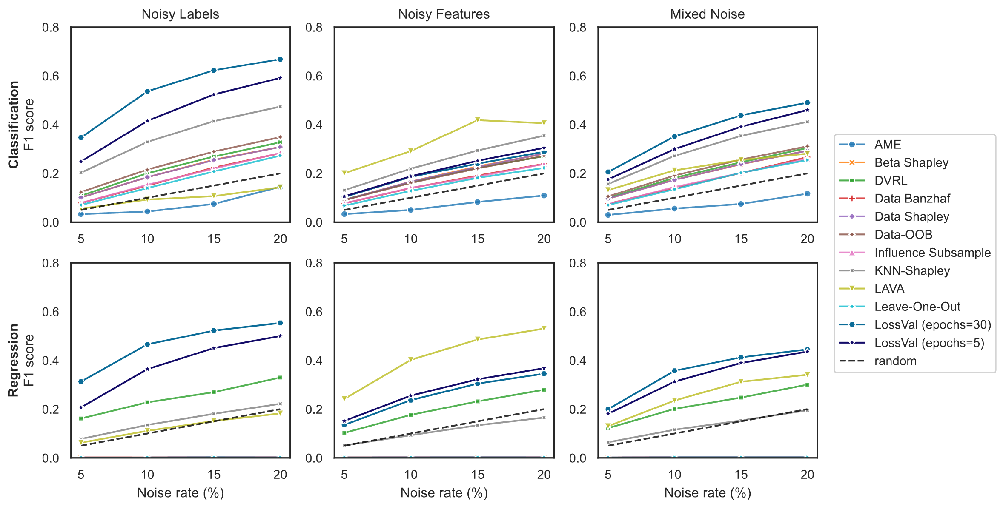

# LossVal

Official implementation of LossVal - Efficient Data Valuation for Neural Networks

Data Valuation is the process if assigning an importance score to each data point in a dataset. 
This importance score can be used to improve the performance of a machine learning model by focusing on the most important data points or for better explaining your model. 
LossVal is a novel method for data valuation that is based on the idea of optimizing the importance scores as weights that are part of the loss function. LossVal is efficient, scalable, and can be used with any differentiable loss function.

In our paper, we show that LossVal achieves state-of-the-art performance on a range of data valuation tasks, without needing any additional training run. 

## Overview

In general, loss functions used with LossVal are of the form:

$$\operatorname{LossVal} = \mathcal{L}_{w}(y, \hat{y}) \cdot \operatorname{OT}_{w}(X_{train}, X_{val})^{2}$$

The model's prediction is denoted by $\hat{y}$, while $y$ represents the target values. 
The optimal transport distance $\operatorname{OT_{w}}$ takes the features of the training data $X_{train}$ and validation data $X_{val}$ as input. 
For the target loss $\mathcal{L}_{w}$, we use instance-weighted formulations of existing loss functions, like a weighted cross-entropy loss or weighted mean-squared error loss (see below).

Weighted cross-entropy loss:
$$\operatorname{CE}_{w} = - \sum^{N}_{n=1} \left[ w_{n} \cdot \sum^{K}_{k=1} y_{n,k} \log(\hat y_{n,k}) \right]$$

Weighted mean-squared error loss:
$$\operatorname{MSE}_{w} = \sum^{N}_{n=1} w_{n} \cdot (y_{n} - \hat{y}_{n})^2$$

Weighted optimal transport distance:
$$\operatorname{OT}_w(X_{train}, X_{val}) = \min_{\gamma \in \Pi(w, 1)} \sum_{n=1}^{N}\sum_{j=1}^{J} c(x_n, x_j) \, \gamma_{n,j}$$

## Use

You can find a basic reference implementation in [`src/lossval.py`](./src/LossVal.py).  Feel free to use this implementation as a starting point for your own experiments and modify to your needs.

## Citation

TODO